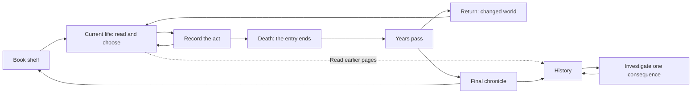

# Chronicle Forge — UI/UX Direction Review

Date: **2026-09-06**. Reviewed branch: `design/v1`, HEAD `34361ab`, including
the existing uncommitted I-3/client changes.

Status: **Design proposal, not an implementation or a declaration that the
experience gates have passed.** Requested by the owner as an independent UI/UX
review. Existing UI choices may be reconsidered under this brief. This document
records the proposed changes and their rationale; it does not silently replace
accepted ADRs. No engine, client code, save, or existing test was changed.

## 1. Recommendation and intended experience

**Keep the Living Chronicle. Make it a readable record of decisions that the
player can later investigate, with a persistent sense of elapsed lives.**

The essential sequence is:

> I understood enough to choose → I remember making that choice → time and
> other lives intervened → something familiar appears in ordinary history →
> I investigate → the record substantiates the connection.

The [v1 definition](design_v1_definition.md) gives this sequence a clear purpose:
recognizing one's forgotten hand in history. P6's tension selection and
[P8's occasional interventions](design_p8_player_experience.md) support it.
P9's persistence and P10–P18's history views supply the memory and evidence.
Their API divisions do not need to become separate destinations in the UI.

The current weakness is the link between **a choice worth remembering** and
**a consequence worth investigating**. Typography, a larger seal, or more
pages cannot establish that link alone. UI/UX owns the presentation and must
also specify the minimum information that narrative and engine-facing work
must provide.

Assumptions for this proposal: Japanese first; desktop pointer and keyboard;
local play; short, finishable worlds; existing deterministic simulation. The
authored tutorial and generated worlds remain separate canons (ADR-001).
The historical August release dates are not treated as a current deadline.

## 2. Reading the documents as a history of decisions

### 2.1 Working source map

| Layer | Sources consulted | How this review uses them |
|---|---|---|
| Original concept | [design.md](design.md), P6 salience/execution, P8 | Causal authorship, intervention cadence, and the transition from power fantasy to historical recognition |
| History infrastructure | P9 persistence/replay/lineage/heritage; P10–P14 observatories; P15/P16; P17/P18 | Existing capabilities and constraints; phase introductions and relevant contracts reviewed, not a fresh audit of every algorithm |
| Product authority | [definition](design_v1_definition.md), [direction](design_v1_direction.md), [ADRs](adr/) | North Star, book frame, dual canon, Japanese-first, horizontal setting |
| Experience specifications | [UX](v1_ux_spec.md), [standard worlds](v1_standard_world_spec.md), [client state](v1_client_state_spec.md), [voice](v1_jp_voice_guide.md), [visual guide](v1_visual_guide.md) | Intended discovery rules, persistence, inputs, language, and their unresolved conflicts |
| Tutorial | [tutorial proof](v1_tutorial_world_proof.md), [content proof](v1_content_proof.md) | Staged hook, branching, delivered/earned distinction, observation protocol; relevant beat and gate sections reviewed |
| Experience roadmap | [journey](player_journey.md), [discovery loop](discovery_loop.md), [game roadmap](game_experience_roadmap.md), release/slice documents | Long-term intent; the Atlas, AI voice, and sharing are not silently restored to v1 |
| Later evidence | [bottlenecks](experience_bottlenecks.md), [first-loop review](review_x1_x4_first_loop.md), diversity analysis, research memos | Historical findings with their dates and build limitations; earlier baselines are not assumed to describe today's client |
| Visual exploration | [art direction](design_v1_art_direction.md), [visual language](design_v1_visual_language.md), [30 roughs](design_v1_visual_exploration.md), [time surface](design_v1_time_surface.md) | Alternatives and counterexamples, not audience-validated aesthetic laws |
| Current increment records | [I-1b](design_v1_i1b_beat_stream.md), [I-2](design_v1_i2_life_loop.md), [I-3](design_v1_i3_rebirth_digest.md), [roadmap](v1_implementation_roadmap.md), [G0](v1_g0_hardware_gate.md) | Latest recorded behavior, cross-checked against local source and saved frames |

This was a focused design review. It did not re-run historical 30/1,000-seed
studies, inspect every image, or execute a fresh GUI/playtest session.

### 2.2 Conflicts that matter before further UI work

| Conflict | Disposition for this proposal |
|---|---|
| Original growth/power fantasy vs. v1's few consequential interventions | Use the v1 definition for the product; do not add stats or build selection to fill the screen |
| Early roadmap defers GUI and includes AI/Atlas vs. ADR-001's book/Must-only scope | Treat the early roadmap as historical; retain the accepted scope boundary |
| UX/tutorial still include ◦ and remembering descendants | ADR-001 removes the memory glyph and tags; the old passages need consolidation before tutorial authoring |
| ADR-003 says Japanese-first; ADR-004 says ADR-003 defers Japanese world content until after v1 | The latter citation is incorrect. Horizontal layout can stand independently; the language inconsistency is not authorization for an English-content release |
| Direction/UX require a geographic map; I-3 records placeless events | Use a history surface now; explicitly propose changing P-11's v1 requirement. Do not place events at invented locations |
| D-03 reserves older-life attribution for investigation; the time surface automatically names older founders | Apply discovery rules to pictures and animation captions as well as to the digest |
| Time spike calls depth elapsed years; implementation makes layer thickness an event count | Define one temporal encoding before building more screens around the strata |
| G0 passes vs. experience readiness | G0 proves a hardware path and particular checks. It is not evidence of recognition, reading comfort, or a finished game |

The UX spec also has internal exceptions that should be made explicit: D-05's
"every Confirm" cannot literally require player initiation while P-10 and D-06
are automatic; D-02's no-current-life marks needs its S-03 promise exception.
Resolve these as distinct states, not as inconsistent uses of the same rule.

## 3. What the current build actually supports

Source inspection: `client/web/book.js`, `time.js`, `strings.js`, `index.html`,
`client/bridge.py`, and `play/beats.py`. Visual inspection included saved G0
seed-42 juncture, aftermath, and digest frames, plus the exploration key-screen
sheet. These are existing captures, not screenshots taken during this review.

Confirmed observations:

- `PAGES` has shelf, opening, juncture, entry, and digest. The time surface is
  implemented separately. A closing summary exists, but the specified finished
  reading/trace/keepable-book experience is not implemented as P-12–P-15.
- The juncture shows bare action labels plus `kind`/`why`, with no adequate
  situation passage. The seed-42 frame even says `your past pulls here` in
  Life 1. Internal tension vocabulary cannot establish a fictional stake.
- The digest has a real act-to-consequence join. `sealed` distinguishes
  explicit player decisions from autonomous actions, but the screen mainly
  expresses that difference through text emphasis.
- S-02 currently names a planted year and founder talent. Its `Recognition`
  data has **no original sealed-act field**. It cannot yet substantiate the
  UX spec's "which choice" reveal in the player's remembered words.
- `time.js` draws `aftermath.hardened` and captions its founder without checking
  discovery state. The digest's careful D-03 filtering does not protect this
  earlier surface.
- Strata thickness counts owned events. Multiple-owner events use the first
  owner for layer placement. Neither thickness nor that placement is a measure
  of elapsed years or exclusive causal responsibility.
- The bridge's shelf still has `books: []`; the client lacks persistent
  save/resume. Flip-back is restricted to opening/shelf navigation, rather
  than the specified read-only archive of previous decisions.
- The current main page is generous cream paper; much of its content is English.
  The saved quiet time frame has very small, low-emphasis captions. These are
  visual observations, not measured contrast or human-comfort results.

### 3.1 Fresh, bounded data check

On 2026-09-06, ran `.venv/bin/python` against
`to_dict(stream(seed, ['1'] * 60))` for the five seeds below: always select the
first displayed option. This is a read-only simulated run, not a player study.

| Seed | Lives | Junctures | First digest contains an explicit sealed act | Named marks / those older than the immediately previous life | First juncture recognition life |
|---|---:|---:|---|---|---:|
| 1 | 3 | 8 | Yes | 8 / 8 | 3 |
| 7 | 3 | 10 | Yes | 8 / 8 | 3 |
| 42 | 4 | 11 | Yes | 8 / 8 | 3 |
| 99 | 5 | 6 | Yes | 8 / 8 | 4 |
| 123 | 4 | 11 | Yes | 8 / 8 | 3 |

The forty named marks all belong to older lives. Combined with the automatic
time-surface caption, this substantiates the D-03 problem on these runs.
The digest floor is encouraging, but neither it nor a fired recognition field
proves a person recognized their choice. Other choice sequences remain untested
in this review.

## 4. Product principles to keep and to sharpen

**Keep:** the book as a continuous artifact; a single recurring soul; the two
voices; occasional decisions; death followed by history; immutable past;
deterministic causal evidence; horizontal Japanese reading; sparse emphasis.

**Sharpen the discovery promise:** the player should be uncertain about what a
choice will become, while understanding what the choice does now. A label such
as "Support Karic" needs who Karic is and what kind of support is being given.
Hiding this information produces guessing, not meaningful uncertainty.

**Teach the operation explicitly; leave the connection to be discovered.**
"調べる" explains an action without revealing its answer. A secret long-press
gesture is not itself a historical mystery. Keep the intimate hold as an
optional gesture, with a visible and keyboard-accessible equivalent.

**Separate authored choice, lived experience, and world history.** Autonomous
actions may belong to the same character's life, but were not personally chosen
by the reader. Reserve the Hand for explicit decisions and confirmed recollections;
present other life events as historical narration. Never call an autonomous
action "the choice you made."

**Use beauty to support the reading task.** Night Reading is a good atmospheric
frame. Its darkness need not reach body text. A store thumbnail and a readable
play screen have different demands; neither a one-third-frame red seal nor a
55% page-area cap is a universal gameplay rule.

## 5. Proposed information architecture

Four player-facing places are sufficient. The existing P-IDs remain useful
implementation references; they need not each create a separate page-turn.

| Place | Player question | Content and behavior |
|---|---|---|
| Shelf | Where did I leave off? | Resume as primary action; new world; finished books. Name and reading position, no collection checklist |
| Current life | What is happening, and what will I do? | Orientation, situation, choices, recorded act; a quiet history strip maintains temporal context |
| History | What happened while I was gone? What do I remember? | Rebirth arrival, dated events, past entries, already-known connections; available read-only during play |
| Investigation | How did this come about? | One selected consequence and a backwards path to evidence; returns to the same historical passage |



History browsing does not rewind simulation. A persistent **「今の頁へ」** action
restores the unresolved choice, selection, focus, and scroll position. Past
options are readable but inert. Do not prohibit rereading merely to prevent
double execution; navigation and commitment need separate state.

### 5.1 Current-life composition

One dominant reading column. Use the remaining area for temporal orientation
and optional context, not a permanently competing full chart. At narrower widths
the history strip becomes a compact header and a tab; the body keeps its size.

```text
┌─────────────────────────────────────────────────────────────────┐
│  世界名     二度目の生 · 15年                  [これまで] [設定] │
│                                                                 │
│  状況の見出し                                 過去 ─── 現在    │
│  誰が何を求め、何が問題になっているか。         生 / 空白 / 生    │
│  いま分かる事実を、短い二〜三文で。                              │
│                                                                 │
│  ○ 行動A                                                        │
│    対象と、いま行うこと。                                       │
│  ○ 行動B                              [調べる] ← 根拠のある対象  │
│    対象と、いま行うこと。                                       │
│  ○ 行動C                                                        │
│                                                                 │
│  選んだ行動がここに入る                     [この行動を記す]     │
└─────────────────────────────────────────────────────────────────┘
```

This is a structural wireframe, not invented game content. Starting copy budgets:
situation 60–120 Japanese characters; option title roughly 12–28; one short
context line when necessary. These are targets for authoring, not truncation
rules. Long names and enlarged text wrap; additional explanation is available
without concealing essential stakes.

Select, inspect, and commit are separate actions. Inspection never selects or
commits an option. The commit button names the pending act or has an unambiguous
adjacent summary. An outcome reuses this page's location and writes the chosen
act before advancing. The first plant cue teaches persistence; later planted
acts retain the mark without replaying the same instructional sentence each time.
This changes emphasis only, not whether a genuine trace is recorded.

### 5.2 The required choice-content contract

The presentation needs these facts at a juncture: target name; known role or
affiliation when available; current relevant condition; immediate action being
performed. Every clause must have a source in reached world data. Intended aims
are allowed only if the underlying action supports them; eventual outcomes
remain unknown.

If the data cannot explain two options differently, record that as a content
gap. Do not invent a drought, a threatened family, a cost, a relationship, or a
future benefit to make the choice sound dramatic. Generic atmosphere is not a
substitute for a legible decision. Generated worlds can use authored Japanese
templates for real facts without acquiring authored historical events.

## 6. Time, return, and discovery

### 6.1 Time has a stable meaning

Use **horizontal position for year** in the history strip: lived intervals,
unlived intervals, and the reached present. Choose a stable scale per view;
move its viewport deliberately rather than rescaling the past after a choice.
Future area contains no predicted names, life count, ending, or event density.
An overview may fit reached history on explicit request and label its date range.

Strata can remain a material transition and investigation treatment. For this
proposal, layer depth indicates historical order, not a quantitative year count.
The year strip carries actual duration. Event density is neither age nor
importance; shared causes must not be drawn as exclusive ownership.

The same visual coordinate must survive from the act record through later
history. Before confirmation, however, a *new consequence* cannot be attached
to a founder's layer or distinctive personal seal in a way that gives away its
origin. The artifact persists; unknown connections remain unknown.

### 6.2 Death and return have two different jobs

Death closes a life with a short factual passage and its dates. It offers no
grade and does not declare whether its traces will survive. Years then advance
through a brief transition into a **stable, readable arrival state**.

At return, show the changed present first, followed by a restrained last-life
connection from I-3's digest. Default emphasis: one explicit sealed act and its
consequence; up to two further permitted lines on request within the existing
three-change budget. The player can compare the consequence with the exact act
record. This is feedback that teaches persistence, not the earned-recognition
climax.

Older-life traces may appear as unassigned historical content and investigate
affordances. They receive no automatic founder caption, personal color, origin
thread, or camera move towards a particular past life. Opening an optional
panel does not by itself make bulk attribution an earned discovery.

Quiet years still end on dates and the return. Do not enlarge insignificant
events to manufacture a climax. An empty echo list is not proof that nothing
happened anywhere; say only what the actual event record supports. A life with
no juncture still receives its own brief entry and temporal place, never a
fabricated decision.

### 6.3 A recognition is a comparison that resolves

1. A consequence appears in ordinary historical language. A recurring real name,
   location, or recorded action phrase gives the reader material to remember.
2. The reader inspects the target, or returns to an earlier entry. The action
   is discoverable by visible text, pointer, and keyboard.
3. The view keeps the consequence in place while exposing its evidence. It
   reaches the earlier life and the original act, in the same wording the
   player saw when committing it.
4. The Hand appears next to the historical passage. A dated connection remains
   available in the book. The page waits until the reader chooses to continue.

Do not add a quiz, require a typed hypothesis, or demand remembering a proper
noun unaided by the archive. The intended skill is noticing and comparing, not
passing a memory exam.

### 6.4 Discovery applies across every surface

| Knowledge state | Permitted representation |
|---|---|
| An explicit act just recorded | The act in the Hand; a promise mark if a seed was actually planted; no future result |
| Historical consequence, uninvestigated | Ordinary text and a truthful investigation affordance; no founder-specific visual encoding |
| Delivered last-life feedback | The permitted previous-life act/consequence pair; no deeper attribution |
| Confirmed connection | Origin life, dated original act, and evidence; persistent across all appearances and resume |
| Single ending invitation | At most one explicit seeded confirmation, identified separately in observation data |

The glyphs stay **⟜ = echo, ❧ = legacy**. They are trace kinds, not the stages
"unconfirmed → confirmed." Use an added line, text, or revealed annotation for
state. Screen-reader text and focus styling carry the same meaning as the
visible glyph. No fake marks are introduced to create uncertainty.

**Proposed color change:** reserve 朱 for a *confirmed connection to a past
life*, consistently in prose and diagrams. Keep ordinary selection and promise
marks in ink. The existing "still shaping the world" property becomes a small
explicit annotation only when a current/reached projection supports it; a newly
named `hardened` mark does not supply that property. This replaces D-4's earlier
朱 = still-shaping rule and needs to be propagated with the other proposal
changes, not mixed into it piecemeal.

## 7. Investigation, ending, and returning to the book

**Trace one real path, not the whole causal graph.** Keep the selected event
anchored while the reader expands backwards. A small number of readable passages
may group repeated events; the reader can expand the real intermediate evidence.
An ellipsis must not be drawn as a direct edge.

P18's proposed `CauseChain` contains a selected origin and ancestor count. It
does **not** supply the ordered intermediate links required by P-14. Its `steps`
is an ancestor count, not a path length. The trace presenter needs a concrete
path of existing edges, the original act where recoverable, and a truthful
indication of alternative causes. An earliest ancestor is **one contributing
origin**, not proof that one life alone caused everything. An autonomous origin
can be traced honestly but cannot satisfy the criterion about a player's choice.

The ending should offer one authored historical closing passage grounded in
the world, one substantiated connection inviting a trace, and two clear actions:
**「歴史を読み返す」 / 「本棚へ」**. Further events remain available in the reading
view. If a run lacks a still-shaping legacy, use another traceable contribution;
if none exists, close honestly without inventing one and record the content-gate
failure. Do not claim a seed sweep guarantees every possible choice path.

Finished books retain the player's confirmed connections and last reading
position. A second world starts from a new shelf slot; an optional line can ask
**「次は、何を残そう。」** without requiring an intent form or predicting a build.
Saved choices, pending selection, reveals, and reading position must survive
quit/resume. This is part of the experience of owning a history, so it belongs
in the first complete prototype, not the final polish pass.

## 8. Visual and interaction baseline

- Warm dark surround; a calm, sufficiently bright reading area. Texture and
  shadows stay beneath content and do not obscure text or focus states.
- Horizontal Japanese; retain the bundled Print/Hand contrast, but also use
  voice, position, and dates. A simplified readable Hand option preserves all
  information. Typeface recognition alone must never be required.
- Starting body size around 18–20 CSS px at the existing desktop viewport;
  approximately 28–32 full-width characters per line when space permits. These
  are prototype choices to evaluate in Japanese, not validated ergonomic claims.
- Enlarging text reflows or scrolls the reading region; it must not silently
  shrink back to fit a fixed paper rectangle. Narrow layouts reduce the history
  panel before reducing text. Actions remain reachable with long names.
- Tab traverses visible controls; Enter/Space activates the focused control;
  dedicated page controls navigate. Optional shortcuts must not turn a page
  and commit a choice from the same key event. Esc closes an inspection or
  opens settings and restores focus on return.
- Investigation has a normal activation path. The optional ~800 ms hold can
  cancel safely and cannot consume a choice click. No timed input is required.
- Reduced motion, readable static time transitions, text size, and keyboard
  operation are baseline prototype requirements. Skip is available from the
  first world; it settles the transition before a separate continuation input.
  Confirmations never disappear on a timer. Pause/settings remain available.
- Save/loading failures state the problem and next action plainly. For example,
  **「記録を保存できませんでした。もう一度保存する」** is more useful than a
  metaphor that leaves the player unsure whether their life was kept.

Procedural history graphics are suitable, but the older claim that a generated
world can **only** have generated images is too restrictive. Reusable paper,
lighting, book materials, and non-specific ornament can be authored assets.
They assert no historical facts. Bespoke depictions of a particular person,
battle, or city require corresponding content support. No new illustration
scope is needed for this prototype.

## 9. Alternatives and trade-offs

| Approach | Benefit | Cost or weakness | Recommendation |
|---|---|---|---|
| Polish the current single leaf only | Smallest change; existing typography | Choices remain under-explained and history remains hard to compare | Insufficient alone |
| Permanent full book + stream chart spread | Continuous world image; uses prior studies | Splits attention, consumes reading width; aggregate theme bands cannot explain an act's consequence | Optional overview, not the default choice screen |
| Current-life page + compact history + expanded investigation | Maintains reading focus while giving memory a persistent place | Requires archive navigation, reveal state, and a real path contract | **Recommended** |
| Map-first or full causal board | Strong spatial/structural overview when supported | Current place data and dense causal topology do not support the implied interaction well | Revisit with suitable data; not a v1 dependency |

The proposed frame is less visually spectacular during ordinary choices than
the largest-seal mocks. It gains room for meaningful decisions and protects the
rare reveal. Use the actual investigation/confirmation state for promotional
captures; do not distort every life into that composition.

The largest risk remains content specificity. If ordinary generated choices and
consequences cannot support recognition, layout cannot fix it. A polished
authored tutorial is insufficient evidence: test a generated world immediately
after it, so differences in specificity and time scale are visible.

## 10. Delivery sequence and file responsibilities

The next deliverable should be **one complete playable discovery sequence**:
readable choice → recorded act → death → years → return → later investigation
→ ending → reopen. This is a prototype scope, not an instruction to begin
implementation in this review.

| Order | Work | Evidence needed before moving on |
|---|---|---|
| 1 | Reconcile discovery vocabulary, language status, temporal encoding, and P-11 replacement using the delta ledger below | One coherent specification; no interface that teaches a removed feature |
| 2 | Author Japanese presentation for a small set of real choices and consequences; keep exact act wording available | A reader can explain the immediate actions; every factual clause has a source |
| 3 | Prototype current life, record, years, return, one investigation, and ending; add minimum save/resume alongside the archive | Complete sequence on real data including a quiet interval; one confirmed trace survives reopening |
| 4 | Run novice observation and revise the weakest beat | Recognition and action comprehension measured separately from gesture execution |
| 5 | Extend to tutorial branches, generated choice variation, long text, and target runtimes | Same interaction and knowledge rules across both canons; no orphan or premature attribution |

Expected implementation responsibilities (no new runtime/dependency implied):

| Files / area | Required responsibility |
|---|---|
| `play/beats.py` and an additive presenter/app seam | Reached-world data, exact sealed-act identity/text, distinction from auto actions, stable references for discovery |
| P18/app trace composition | Actual ordered edge path and alternate-origin handling; do not use ancestor count as a path |
| `client/web/book.js`, `index.html` | Reading/inspection/commit navigation and focus; current vs. historical page state |
| `client/web/time.js` | Defined temporal encoding; no unrevealed founder/name/color leakage; static equivalent |
| `client/web/book.css`, `strings.js` | Japanese reading, responsive layout, input affordances, color semantics, and bounded authored wording |
| Client persistence per D-6 | Atomic choice/reveal/cursor save, exact resume, immutable past, correct book identity |

This does not require changing salience, RNG, world generation, or canonical
recipes. Any missing *world fact* is escalated as a separate content/engine
design issue rather than invented by the presenter. Any contract extension
needs its own implementation design and focused verification.

## 11. Verification of the proposed experience

### Automated checks for later implementation

Exercise the same event on entry, time surface, digest, history, trace, and
resume. Before confirmation, no older-life founder identity may appear through
text, accessible labels, geometry, color, or focus behavior. After confirmation,
its evidence persists consistently. Check against the actual reached prefix,
not merely the world that a full replay already knows will happen.

Also verify: inspection cannot commit; keyboard events cannot double-advance;
old choices cannot be executed; every visible causal link has a real edge;
multiple contributors are not misrepresented; terminal/quiet/empty cases close
honestly; same-seed books with different choices cannot share reveals. Existing
engine integrity checks remain the regression boundary. Do not copy old golden
hashes from superseded schedule sections as the current test baseline.

### Human observation

Use the existing R1/R2 Japanese fresh-cohort structure. Five participants can
identify design failures but do not establish population-level certainty.

| Question | Observation |
|---|---|
| Does the player know their role and how to proceed? | First meaningful choice available within roughly 1–2 minutes, without mandatory front-matter reading; target, not an achieved result |
| Was the choice meaningful? | Player can explain what they chose to do now, before any outcome is revealed; use a separate comprehension pass if asking would prime the recognition test |
| Did recognition happen? | Record spontaneous connection/intent to inspect and subsequent explanation of life + act + consequence; a completed hold is only an interaction event |
| Was death a continuation? | Retain SC-3's restart/loss-coded observations; player understands there is a next life |
| Can history substantiate the connection? | Retain SC-2's explanation bar; inspect an actual path without moderator help |
| Does a new world invite a different intention? | Retain SC-4's intention question; do not seed the answer with preset archetypes |
| Can the book be comfortably used? | Repeat with text enlargement, keyboard, reduced motion, long names, and quit/resume |

Retain the existing SC-1 overall threshold (at least 4/5 by 30 minutes) and
its independent-discovery requirement (at least 3/5), but replace **"hold path"**
as its proxy with **player-initiated recognition supported by an explanation**.
Accessible button or keyboard inspection is equally eligible. A fallback reveal
is recorded as assisted exposure, never relabeled as independent recognition.
Delivered digest comprehension likewise cannot alone pass the earned bar.

Neither human results nor new runtime/GUI test results are claimed in this
document. This review checked existing source/captures and the five-seed data
sample in §3.1; the human validations remain to be performed.

## 12. Proposed change ledger

These are explicit proposal deltas. On adoption, update the indicated sources
together; until then their accepted rules remain the baseline. This avoids
making a new review document silently overrule the old specifications.

| ID | Proposed change | Sources to reconcile |
|---|---|---|
| UX-R1 | Compact history + expandable investigation; use a non-geographic history surface for v1 instead of mandatory map placement | direction §4/§7; UX P-10/P-11; I-3/roadmap scope; ADR follow-up for the scope change |
| UX-R2 | Teach investigation explicitly; optional hold with ordinary accessible activation; separate inspect/select/commit | UX I-03–I-05; visual H-1/H-2; client state; tutorial asides |
| UX-R3 | D-03/D-04 apply to every visual/caption, including C1; unconfirmed origins never pre-attached to life layers | UX discovery rules; time-surface/I-1b; I-3 boundary; client state |
| UX-R4 | Year is horizontal position; strata is historical order/material, not event-count-as-years | time-surface design; visual language; time renderer specification |
| UX-R5 | 朱 means confirmed past-life connection; glyphs remain trace kinds; current influence gets truthful separate text | UX §5/§7; visual guide §5/§6; art/exploration/time studies |
| UX-R6 | Exact act evidence and ordered real causal path; distinguish player decisions, auto actions, and contributing causes | recognition beat contract; P18; UX P-14; D-6 reveal identity |
| UX-R7 | One emphasized last-life feedback item, further permitted items on request; quiet years and empty endings specified | UX P-10/P-12; standard-world RD rules; I-3; voice guide |
| UX-R8 | Full read-only past and minimum persistent state in the complete prototype; no re-execution while rereading | I-2 flip-back rationale; UX navigation; D-6; roadmap order |
| UX-R9 | Accessibility and skip from the first world; explicit operational copy allowed; assess understanding independently of gesture | UX §6/§8; visual motion; voice audit exceptions for UI controls; tutorial protocol; DoD-1/7 |
| UX-R10 | Reconcile already-decided two-glyph and Japanese-first baseline; separate historical schedules from current status | ADR-003/004 interpretation; UX/tutorial stale ◦ passages; roadmap status |

The recommended next review object is the complete sequence in §10 with real
Japanese copy and real causal evidence. It should let the owner judge what the
player will read, choose, remember, and discover, before expanding the page set.
